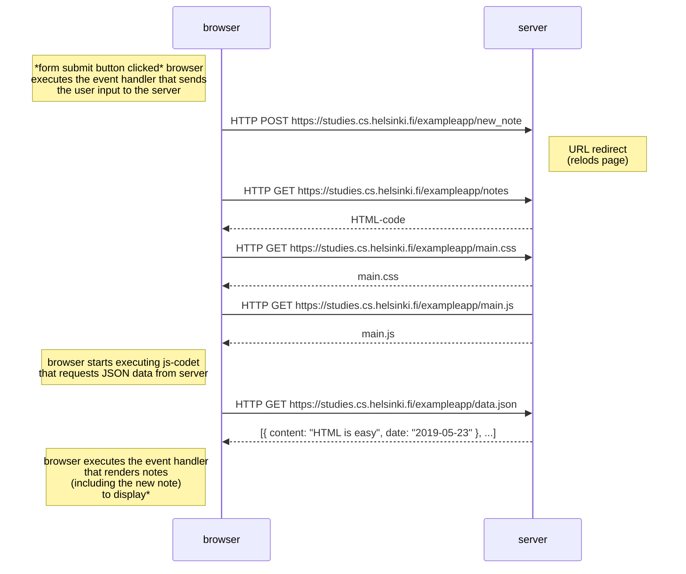

# New note

```mermaid
 sequenceDiagram
    Note left of browser: *form submit button  clicked* browser <br>  executes the event handler that sends <br> the user input to the server
    browser->>server:  HTTP POST https://studies.cs.helsinki.fi/exampleapp/new_note
    Note right of server: URL redirect <br> (relods page)
    browser->>server: HTTP GET https://studies.cs.helsinki.fi/exampleapp/notes
    server-->>browser: HTML-code
    browser->>server: HTTP GET https://studies.cs.helsinki.fi/exampleapp/main.css
    server-->>browser: main.css
    browser->server: HTTP GET https://studies.cs.helsinki.fi/exampleapp/main.js
    server-->>browser: main.js
    Note left of browser: browser starts executing js-codet <br> that requests JSON data from server 
    browser->>server: HTTP GET https://studies.cs.helsinki.fi/exampleapp/data.json
    server-->>browser: [{ content: "HTML is easy", date: "2019-05-23" }, ...]
    Note left of browser: browser executes the event handler <br> that renders notes <br> (including the new note) <br>to display*
```
