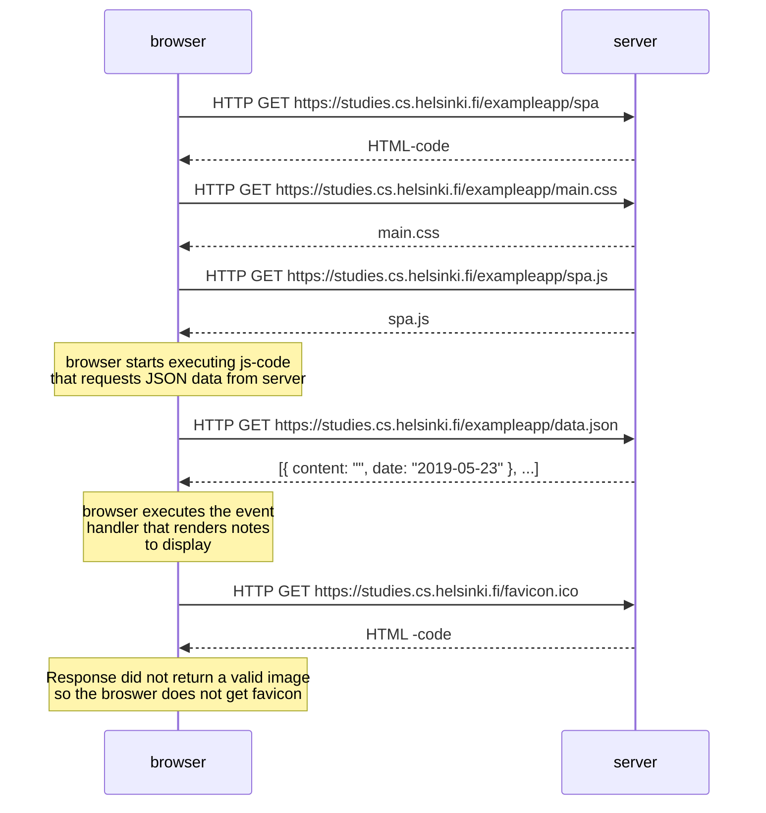

# Single page app

```mermaid
 sequenceDiagram
    browser->>server:  HTTP GET https://studies.cs.helsinki.fi/exampleapp/spa
    server-->>browser: HTML-code
    browser->>server: HTTP GET https://studies.cs.helsinki.fi/exampleapp/main.css
    server-->>browser: main.css
    browser->server: HTTP GET https://studies.cs.helsinki.fi/exampleapp/spa.js
    server-->>browser: spa.js
    Note over browser: browser starts executing js-code <br> that requests JSON data from server 
    browser->>server: HTTP GET https://studies.cs.helsinki.fi/exampleapp/data.json
    server-->>browser: [{ content: "", date: "2019-05-23" }, ...]
    Note over browser: browser executes the event <br> handler that renders notes <br>to display
   browser->>server: HTTP GET https://studies.cs.helsinki.fi/favicon.ico
   server-->>browser: HTML -code
   Note over browser: Response did not return a valid image <br> so the broswer does not get favicon 
```
