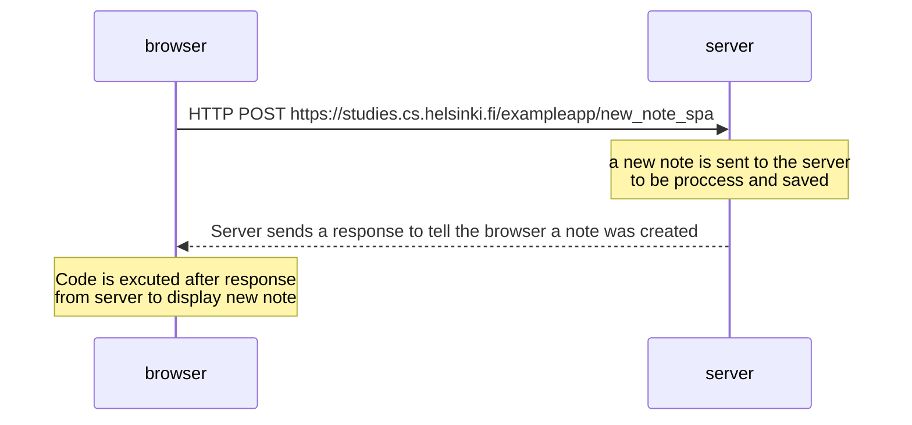

# Single page app - New Note

```mermaid
 sequenceDiagram
     browser->>server: HTTP POST https://studies.cs.helsinki.fi/exampleapp/new_note_spa
     Note over server: a new note is sent to the server <br> to be proccess and saved
    server-->>browser: Server sends a response to tell the browser a note was created
      Note over browser: Code is excuted after response  <br>from server to display new note
```
